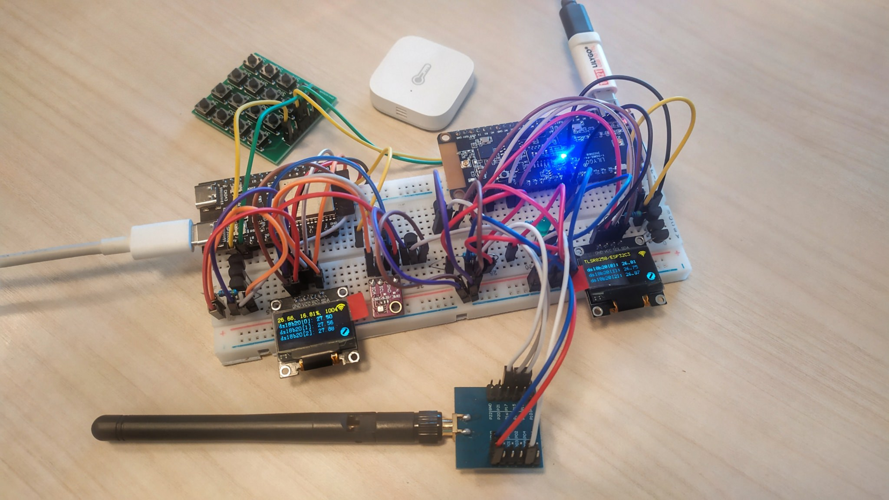
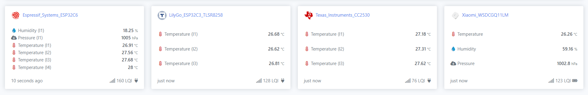
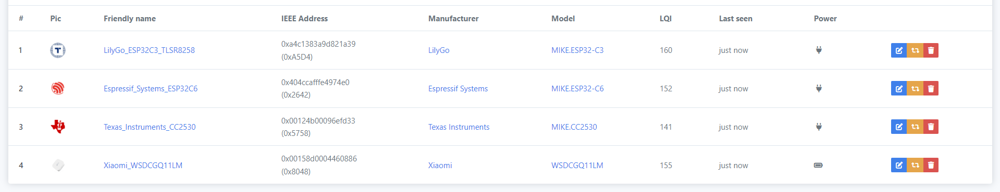

URL: https://github.com/mozolin/Zigbee2MQTT_CC2538  
  
# Zigbee2MQTT_CC2538  
  
Details:  
- [Example: LilyGo T-Zigbee TLSR8258 (Telink SDK)](https://github.com/mozolin/LilyGo_T-Zigbee_TLSR8258)  
- [Example: DS18B20 sensors with LilyGo T-Zigbee ESP32C3 (Platformio IDE)](https://github.com/mozolin/LilyGo_T-Zigbee_ESP32C3)  
- [Example: BMX280 sensors with CC2530 (PTVO Firmware Config & SmartRF Flash Programmer)](https://github.com/mozolin/CC2530_Zigbee)  
- [Example: BMX280 & DS18B20 sensors with ESP32-C6 (Espressif IDE)](https://github.com/mozolin/esp32c6_zigbee)  
  

  